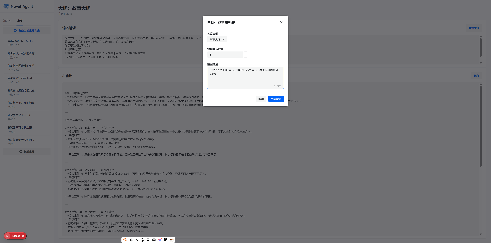
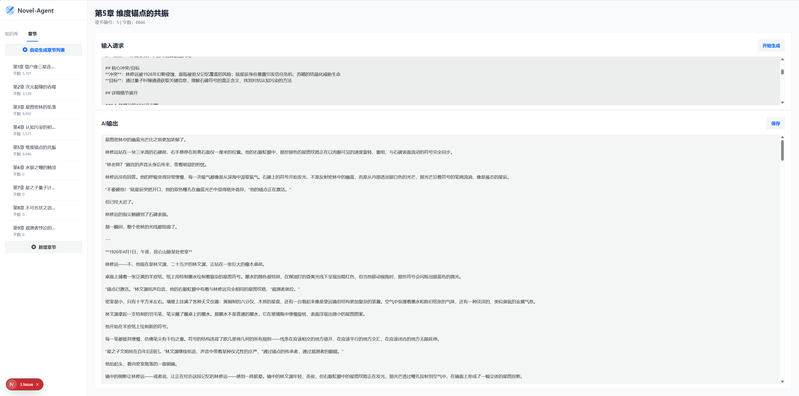
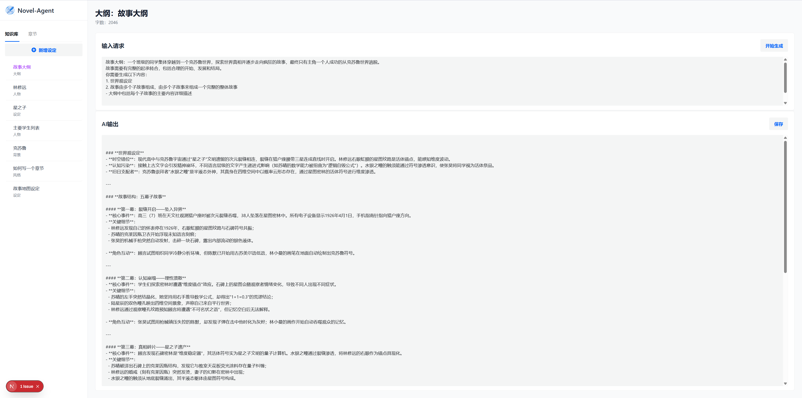

# Novel Agent - AI拾光研发小说创作助手


Novel Agent是一个基于Next.js和LangChain构建的AI小说创作助手，提供了完整的小说章节管理和AI辅助创作功能。项目集成了LangGraph工作流和自定义工具链，实现了智能化的章节生成和内容创作。

## 功能特点

### 章节管理
- 创建、编辑、删除小说章节
- 自动生成章节列表（支持大纲关联）
- 章节编号和字数统计
- 章节内容实时编辑和保存
- 支持按ID和ID范围检索章节

### AI辅助创作
- 集成OpenAI API和LangChain框架
- 支持流式输出和一次性调用
- 基于StateGraph的三步式章节生成工作流：
  1. 初步生成章节大纲
  2. 丰富章节细节内容
  3. 最终确定章节内容
- 自定义LangChain工具支持章节CRUD操作
- 智能上下文管理和章节关联

### 知识库管理
- 创建、编辑、删除小说知识库
- 多类型知识库支持（人物、背景、设定、大纲、风格、其他）
- 知识库内容与章节创作关联
- 支持知识库内容流式生成

### 自动生成
- 基于LangGraph工作流的智能章节生成
- 支持指定章节数量和知识库关联
- AI根据现有章节和知识库生成连贯内容
- 支持章节间关联和情节连续性

## 技术栈

- **前端框架**: Next.js 16 (App Router) + React 19
- **UI组件库**: Semi UI
- **AI框架**: LangChain + LangGraph
- **AI接口**: OpenAI API (v6.10.0)
- **MCP支持**: @modelcontextprotocol/sdk
- **数据库**: SQL.js (浏览器内SQLite)
- **样式**: Tailwind CSS
- **开发语言**: TypeScript

## 部署和配置

### 环境要求
- Node.js 18.x 或更高版本
- npm 或 yarn 包管理器

### 安装和运行

1. 克隆项目
```bash
git clone <项目仓库地址>
cd novel-agent
```

2. 安装依赖
```bash
npm install
```

3. 配置环境变量
创建 `.env` 文件并配置以下内容：
```env
# OpenAI API 配置
OPENAI_API_KEY=your-openai-api-key
OPENAI_BASE_URL=https://api.openai.com/v1
OPENAI_MODEL=gpt-3.5-turbo

# 项目配置
NEXT_PUBLIC_APP_NAME=Novel Agent
```

4. 启动开发服务器
```bash
npm run dev
```

5. 构建生产版本
```bash
npm run build
```

6. 运行生产版本
```bash
npm start
```

## 使用说明

### 章节管理



1. **创建章节**
   - 点击左侧章节列表中的"添加章节"按钮
   - 输入章节标题和内容
   - 点击提交按钮

2. **编辑章节**
   - 选择要编辑的章节
   - 点击编辑按钮
   - 修改章节内容
   - 点击提交按钮

3. **自动生成章节**
   - 点击章节列表顶部的"自动生成章节列表"按钮
   - 输入预期章节数量
   - 点击生成按钮
   - AI将根据现有大纲生成指定数量的章节

### AI辅助创作



1. **生成章节内容**
   - 选择一个章节
   - 在右侧编辑区域输入创作提示
   - 点击"开始生成"按钮
   - AI将生成章节内容并显示在编辑区域

2. **使用工具调用**
   - AI可以调用内置工具进行计算和操作
   - 支持多轮工具调用（如5×7，结果×20）
   - 工具调用结果将显示在AI输出区域

### 知识库管理



1. **创建知识库**
   - 点击左侧知识库列表中的"添加知识库"按钮
   - 输入知识库名称和内容
   - 选择知识库类型
   - 点击提交按钮

2. **编辑知识库**
   - 选择要编辑的知识库
   - 点击编辑按钮
   - 修改知识库内容
   - 点击提交按钮

## 项目结构

```
app/
  api/               # API路由
    ai/              # AI相关API
      chat/          # AI聊天API
      generate-chapter-content/  # 章节内容生成API
      generate-chapters/         # 章节列表生成API
      generate-outline-content/  # 大纲内容生成API
    chapters/        # 章节管理API
      [id]/          # 单个章节操作API
      route.ts       # 章节列表API
    outlines/        # 大纲管理API
      [id]/          # 单个大纲操作API
      route.ts       # 大纲列表API
  components/        # React组件
    ai/              # AI相关组件
      AIInteraction.tsx
    chapter/         # 章节相关组件
      AutoGenerateModal.tsx  # 自动生成章节模态框
      ChapterModal.tsx       # 章节编辑模态框
    outline/         # 大纲相关组件
      OutlineModal.tsx       # 大纲编辑模态框
  lib/               # 核心功能库
    chains/          # LangChain工作流
      base.ts        # 基础配置
      generate_chapter.ts           # 章节生成链
      generate_chapter_content.ts   # 章节内容生成链
      generate_chapter_with_planning.ts  # 基于规划的章节生成
      generate_outline_content.ts   # 大纲内容生成链
    ai-client.tsx    # AI客户端组件
    ai-service-v2.ts # AI服务实现
    database.ts      # 数据库操作
    langchain-tools.ts  # LangChain工具定义
  page.tsx           # 主页面组件
  layout.tsx         # 页面布局
  globals.css        # 全局样式

prompts/             # 提示词模板
  content.md         # 内容生成提示词

public/              # 静态资源
package.json         # 项目配置
next.config.ts       # Next.js配置
README.md            # 项目说明文档
```

## 开发说明

### LangChain工作流
项目使用LangGraph实现了基于StateGraph的三步式章节生成工作流：
1. **generate_initial**: 初步生成章节大纲
2. **enrich**: 丰富章节细节内容
3. **finalize**: 最终确定章节内容

### 自定义工具
实现了多种LangChain工具用于章节和大纲管理：
- CreateChapterTool: 创建章节
- UpdateChapterTool: 更新章节
- DeleteChapterTool: 删除章节
- GetChapterByIdTool: 根据ID获取章节
- GetChaptersByIdRangeTool: 根据ID范围获取章节
- CreateOutlineTool: 创建大纲
- UpdateOutlineTool: 更新大纲
- DeleteOutlineTool: 删除大纲

### 调试日志
- AI调用日志显示在浏览器控制台
- LangChain工具调用日志以`[ToolName]`前缀显示
- StateGraph工作流状态变化日志
- 错误信息将在界面上显示并记录到控制台

## 许可证

MIT License

## 贡献

欢迎提交Issue和Pull Request来改进项目。

## 联系方式

如有问题或建议，请通过项目仓库提交Issue。
